# System Architecture Analysis

## Overview

- **Project**: /home/tom/github/semcod/deta
- **Primary Language**: python
- **Languages**: python: 22, yaml: 11, yml: 3, shell: 2, json: 1
- **Analysis Mode**: static
- **Total Functions**: 187
- **Total Classes**: 14
- **Modules**: 41
- **Entry Points**: 106

## Architecture by Module

### project.map.toon
- **Functions**: 92
- **File**: `map.toon.yaml`

### deta.formatter.toon
- **Functions**: 13
- **File**: `toon.py`

### deta.scanner.compose
- **Functions**: 13
- **Classes**: 1
- **File**: `compose.py`

### deta.cli
- **Functions**: 11
- **File**: `cli.py`

### deta.web.app
- **Functions**: 10
- **Classes**: 1
- **File**: `app.py`

### deta.formatter.graph
- **Functions**: 8
- **File**: `graph.py`

### deta.monitor.watcher
- **Functions**: 6
- **File**: `watcher.py`

### deta.monitor.alerter
- **Functions**: 5
- **File**: `alerter.py`

### deta.scanner.env
- **Functions**: 5
- **File**: `env.py`

### deta.monitor.prober
- **Functions**: 4
- **Classes**: 1
- **File**: `prober.py`

### deta.scanner.ports
- **Functions**: 4
- **Classes**: 1
- **File**: `ports.py`

### deta.integration.semcod
- **Functions**: 4
- **File**: `semcod.py`

### deta.config
- **Functions**: 3
- **Classes**: 8
- **File**: `config.py`

### deta.core
- **Functions**: 3
- **Classes**: 1
- **File**: `core.py`

### deta.scanner.python
- **Functions**: 3
- **File**: `python.py`

### deta.scanner.openapi
- **Functions**: 2
- **Classes**: 1
- **File**: `openapi.py`

### deta.scanner.npm
- **Functions**: 1
- **File**: `npm.py`

## Key Entry Points

Main execution flows into the system:

### deta.cli.main
- **Calls**: typer.Typer, app.command, app.command, app.command, app.command, app, typer.Argument, typer.Option

### deta.scanner.npm.scan_npm
> Scan for package.json files and extract package information.

Args:
    root: Root directory to scan
    max_depth: Maximum directory depth to scan
  
- **Calls**: root.rglob, len, json.loads, result.append, pkg.relative_to, pkg.read_text, data.get, data.get

### deta.scanner.openapi.scan_openapi
> Scan for OpenAPI files and extract endpoint definitions.

Args:
    root: Root directory to scan
    max_depth: Maximum directory depth to scan
    
R
- **Calls**: root.rglob, len, deta.scanner.openapi._load, None.get, data.get, None.items, api_file.relative_to, data.get

### deta.integration.semcod.pre_deploy_check
> Run pre-deployment infrastructure validation.

This function checks for critical anomalies before deployment and returns
a pass/fail status along with
- **Calls**: Path, project.map.toon.build_topology, topology.detect_anomalies, issues.append, issues.append, len, a.get, a.get

### deta.monitor.watcher.watch_configs
> Watch for configuration file changes and emit events.

Args:
    root: Root directory to watch
    on_change: Async callback function that receives ch
- **Calls**: awatch, print, deta.monitor.watcher._is_config_file, deta.monitor.watcher._poll_configs, on_change, str, None.isoformat, hasattr

### deta.scanner.compose.scan_compose
> Scan for docker-compose files and extract service definitions.

Args:
    root: Root directory to scan
    max_depth: Maximum directory depth to scan

- **Calls**: deta.scanner.compose._get_yaml_loader, deta.scanner.compose._collect_compose_files, project_files.items, deta.scanner.compose._merge_services, merged_services.items, deta.scanner.compose._build_service_def, all_services.append

### deta.integration.semcod.generate_for_pyqual
> Generate dependency data for pyqual (Python quality checker).

Args:
    root: Root directory to scan
    depth: Maximum scan depth
    
Returns:
    
- **Calls**: Path, deta.scanner.python.scan_python, list, set, None.append, None.update

### deta.web.app.ConnectionManager.broadcast
- **Calls**: json.dumps, self.disconnect, conn.send_text, dead.append

### deta.integration.semcod.generate_for_sumd
> Generate infrastructure report for sumd pipeline.

This function creates a toon-formatted infrastructure report that can be
consumed by sumd (Semcod u
- **Calls**: Path, Path, project.map.toon.build_topology, project.map.toon.save_toon

### deta.integration.semcod.generate_for_vallm
> Generate service metadata for vallm (validation LLM).

Args:
    root: Root directory to scan
    depth: Maximum scan depth
    
Returns:
    Dictiona
- **Calls**: Path, project.map.toon.build_topology, topology.detect_anomalies, topology.services.items

### deta.web.app.ConnectionManager.connect
- **Calls**: self._connections.add, websocket.accept

### deta.formatter.toon.save_toon
> Save toon format to file.

Args:
    topology: InfraTopology object
    output_path: Path to save the toon file
    project_name: Optional project nam
- **Calls**: deta.formatter.toon.generate_toon, output_path.write_text

### deta.web.app.ConnectionManager.__init__
- **Calls**: set

### deta.web.app.ConnectionManager.disconnect
- **Calls**: self._connections.discard

### deta.core.Wup.__init__
> Initialize a Wup instance.

Args:
    name: The name of the wup
    dosage: The dosage information (optional)

### deta.core.Wup.__repr__

### deta.core.Wup.get_info
> Return wup information.

### project.map.toon._get_topology

### project.map.toon._filter_anomalies

### project.map.toon._print_summary

### project.map.toon._resolve_formats

### project.map.toon._probe_once

### project.map.toon._write_outputs

### project.map.toon.scan

### project.map.toon.monitor

### project.map.toon._monitor_loop

### project.map.toon.diff

### project.map.toon.main

### project.map.toon.load_config

### project.map.toon._load_yaml

## Process Flows

Key execution flows identified:

### Flow 1: main
```
main [deta.cli]
```

### Flow 2: scan_npm
```
scan_npm [deta.scanner.npm]
```

### Flow 3: scan_openapi
```
scan_openapi [deta.scanner.openapi]
  └─> _load
```

### Flow 4: pre_deploy_check
```
pre_deploy_check [deta.integration.semcod]
  └─ →> build_topology
```

### Flow 5: watch_configs
```
watch_configs [deta.monitor.watcher]
  └─> _is_config_file
  └─> _poll_configs
      └─> _scan_file_mtimes
      └─> _scan_file_mtimes
```

### Flow 6: scan_compose
```
scan_compose [deta.scanner.compose]
  └─> _get_yaml_loader
  └─> _collect_compose_files
```

### Flow 7: generate_for_pyqual
```
generate_for_pyqual [deta.integration.semcod]
  └─ →> scan_python
      └─> _load_toml
```

### Flow 8: broadcast
```
broadcast [deta.web.app.ConnectionManager]
```

### Flow 9: generate_for_sumd
```
generate_for_sumd [deta.integration.semcod]
  └─ →> build_topology
  └─ →> save_toon
```

### Flow 10: generate_for_vallm
```
generate_for_vallm [deta.integration.semcod]
  └─ →> build_topology
```

## Key Classes

### deta.web.app.ConnectionManager
- **Methods**: 4
- **Key Methods**: deta.web.app.ConnectionManager.__init__, deta.web.app.ConnectionManager.connect, deta.web.app.ConnectionManager.disconnect, deta.web.app.ConnectionManager.broadcast

### deta.core.Wup
> Base class for wup operations.
- **Methods**: 3
- **Key Methods**: deta.core.Wup.__init__, deta.core.Wup.__repr__, deta.core.Wup.get_info

### deta.scanner.ports.PortBinding
> Resolved view of a single port mapping.
- **Methods**: 1
- **Key Methods**: deta.scanner.ports.PortBinding.is_resolved

### deta.config.WatchConfig
> Watch configuration for file monitoring.
- **Methods**: 0

### deta.config.ScanConfig
> Scan configuration.
- **Methods**: 0

### deta.config.AnomalyConfig
> Anomaly detection configuration.
- **Methods**: 0

### deta.config.MonitorConfig
> Real-time monitoring configuration.
- **Methods**: 0

### deta.config.OutputConfig
> Output configuration.
- **Methods**: 0

### deta.config.AlertConfig
> Alert configuration.
- **Methods**: 0

### deta.config.WebConfig
> Web dashboard configuration.
- **Methods**: 0

### deta.config.DetaConfig
> Main deta configuration.
- **Methods**: 0

### deta.monitor.prober.ProbeResult
> Result of a health check probe.
- **Methods**: 0

### deta.scanner.openapi.EndpointDef
> Definition of an OpenAPI endpoint.
- **Methods**: 0

### deta.scanner.compose.ServiceDef
> Definition of a Docker Compose service.
- **Methods**: 0

## Data Transformation Functions

Key functions that process and transform data:

### deta.config._parse_config
> Parse configuration dictionary into DetaConfig object.
- **Output to**: DetaConfig, WatchConfig, ScanConfig, AnomalyConfig, MonitorConfig

### deta.cli._resolve_formats
- **Output to**: list, None.lower, normalized.append, item.strip

### deta.scanner.python._parse_requirements
> Parse requirements.txt file and extract package names.
- **Output to**: open, line.strip, None.strip, line.startswith, line.startswith

### deta.scanner.ports.parse_port
> Parse a compose-style port string and resolve ``${VAR}`` references.
- **Output to**: None.strip, PortBinding, PortBinding, deta.scanner.env.interpolate, interpolated.rsplit

### deta.scanner.ports.parse_ports
- **Output to**: deta.scanner.ports.parse_port

### project.map.toon._resolve_formats

### project.map.toon._parse_config

### project.map.toon._parse_ports

### project.map.toon._parse_depends_on

### project.map.toon._parse_env

### project.map.toon._parse_labels

### project.map.toon.parse_port

### project.map.toon.parse_ports

### project.map.toon._parse_requirements

### project.map.toon.test_parse_port_single

### project.map.toon.test_parse_port_mapping

### project.map.toon.test_parse_port_with_host

### project.map.toon.test_parse_port_with_protocol

### project.map.toon.test_parse_port_env

### project.map.toon.test_parse_port_env_default

### deta.formatter.toon._format_header
> Generate header section.
- **Output to**: None.strftime, datetime.now

### deta.formatter.toon._format_health
> Generate HEALTH section.
- **Output to**: sum, len, len, len

### deta.formatter.toon._format_alert_line
> Format single alert line.
- **Output to**: None.get, None.join, alert.get, Path, None.join

### deta.formatter.toon._format_alerts
> Generate ALERTS section.
- **Output to**: sorted, lines.extend, lines.append, deta.formatter.toon._format_alert_line, severity_order.get

### deta.formatter.toon._format_service_line
> Format single service line.
- **Output to**: None.join, None.join

## Behavioral Patterns

### recursion_interpolate_recursive
- **Type**: recursion
- **Confidence**: 0.90
- **Functions**: deta.scanner.env.interpolate_recursive

### recursion__deep_merge
- **Type**: recursion
- **Confidence**: 0.90
- **Functions**: deta.scanner.compose._deep_merge

### state_machine_ConnectionManager
- **Type**: state_machine
- **Confidence**: 0.70
- **Functions**: deta.web.app.ConnectionManager.__init__, deta.web.app.ConnectionManager.connect, deta.web.app.ConnectionManager.disconnect, deta.web.app.ConnectionManager.broadcast

## Public API Surface

Functions exposed as public API (no underscore prefix):

- `deta.cli.main` - 55 calls
- `deta.web.app.create_app` - 46 calls
- `deta.cli.diff` - 27 calls
- `deta.formatter.toon.generate_toon` - 21 calls
- `deta.scanner.python.scan_python` - 20 calls
- `deta.monitor.alerter.print_topology_table` - 19 calls
- `deta.formatter.graph.generate_graph_yaml` - 19 calls
- `deta.scanner.npm.scan_npm` - 18 calls
- `deta.formatter.graph.generate_mermaid` - 18 calls
- `deta.monitor.prober.probe_service` - 16 calls
- `deta.formatter.graph.save_png` - 16 calls
- `deta.scanner.openapi.scan_openapi` - 14 calls
- `deta.scanner.env.load_env_file` - 14 calls
- `deta.scanner.ports.parse_port` - 12 calls
- `deta.cli.scan` - 10 calls
- `deta.monitor.alerter.alert_anomaly` - 10 calls
- `deta.integration.semcod.pre_deploy_check` - 10 calls
- `deta.monitor.watcher.watch_configs` - 10 calls
- `deta.scanner.env.discover_env` - 9 calls
- `deta.config.load_config` - 7 calls
- `deta.scanner.env.interpolate_recursive` - 7 calls
- `deta.scanner.compose.scan_compose` - 7 calls
- `deta.scanner.env.interpolate` - 6 calls
- `deta.integration.semcod.generate_for_pyqual` - 6 calls
- `deta.web.app.run_dashboard` - 5 calls
- `deta.cli.monitor` - 4 calls
- `deta.web.app.ConnectionManager.broadcast` - 4 calls
- `deta.scanner.env.merge_env_files` - 4 calls
- `deta.integration.semcod.generate_for_sumd` - 4 calls
- `deta.integration.semcod.generate_for_vallm` - 4 calls
- `deta.monitor.alerter.alert_probe_failure` - 3 calls
- `deta.monitor.alerter.alert_probe_success` - 3 calls
- `deta.web.app.ConnectionManager.connect` - 2 calls
- `deta.monitor.prober.probe_all` - 2 calls
- `deta.formatter.graph.save_graph_yaml` - 2 calls
- `deta.formatter.graph.save_mermaid` - 2 calls
- `deta.formatter.toon.save_toon` - 2 calls
- `deta.web.app.ConnectionManager.disconnect` - 1 calls
- `deta.scanner.ports.parse_ports` - 1 calls
- `deta.scanner.ports.published_url` - 1 calls

## System Interactions

How components interact:

```mermaid
graph TD
    main --> Typer
    main --> command
    scan_npm --> rglob
    scan_npm --> len
    scan_npm --> loads
    scan_npm --> append
    scan_npm --> relative_to
    scan_openapi --> rglob
    scan_openapi --> len
    scan_openapi --> _load
    scan_openapi --> get
    pre_deploy_check --> Path
    pre_deploy_check --> build_topology
    pre_deploy_check --> detect_anomalies
    pre_deploy_check --> append
    watch_configs --> awatch
    watch_configs --> print
    watch_configs --> _is_config_file
    watch_configs --> _poll_configs
    watch_configs --> on_change
    scan_compose --> _get_yaml_loader
    scan_compose --> _collect_compose_fil
    scan_compose --> items
    scan_compose --> _merge_services
    generate_for_pyqual --> Path
    generate_for_pyqual --> scan_python
    generate_for_pyqual --> list
    generate_for_pyqual --> set
    generate_for_pyqual --> append
    broadcast --> dumps
```



## Reverse Engineering Guidelines

1. **Entry Points**: Start analysis from the entry points listed above
2. **Core Logic**: Focus on classes with many methods
3. **Data Flow**: Follow data transformation functions
4. **Process Flows**: Use the flow diagrams for execution paths
5. **API Surface**: Public API functions reveal the interface

## Context for LLM

Maintain the identified architectural patterns and public API surface when suggesting changes.