# System Architecture Analysis

## Overview

- **Project**: /home/tom/github/semcod/deta
- **Primary Language**: python
- **Languages**: python: 18, yaml: 11, shell: 2, json: 1, toml: 1
- **Analysis Mode**: static
- **Total Functions**: 97
- **Total Classes**: 11
- **Modules**: 34
- **Entry Points**: 52

## Architecture by Module

### project.map.toon
- **Functions**: 42
- **File**: `map.toon.yaml`

### deta.cli
- **Functions**: 11
- **File**: `cli.py`

### deta.formatter.graph
- **Functions**: 9
- **File**: `graph.py`

### deta.monitor.alerter
- **Functions**: 5
- **File**: `alerter.py`

### deta.scanner.compose
- **Functions**: 5
- **Classes**: 1
- **File**: `compose.py`

### deta.integration.semcod
- **Functions**: 4
- **File**: `semcod.py`

### deta.monitor.prober
- **Functions**: 4
- **Classes**: 1
- **File**: `prober.py`

### deta.core
- **Functions**: 3
- **Classes**: 1
- **File**: `core.py`

### deta.scanner.python
- **Functions**: 3
- **File**: `python.py`

### deta.monitor.watcher
- **Functions**: 3
- **File**: `watcher.py`

### deta.config
- **Functions**: 3
- **Classes**: 7
- **File**: `config.py`

### deta.scanner.openapi
- **Functions**: 2
- **Classes**: 1
- **File**: `openapi.py`

### deta.formatter.toon
- **Functions**: 2
- **File**: `toon.py`

### deta.scanner.npm
- **Functions**: 1
- **File**: `npm.py`

## Key Entry Points

Main execution flows into the system:

### deta.cli.main
- **Calls**: typer.Typer, app.command, app.command, app.command, app, typer.Argument, typer.Option, typer.Option

### deta.scanner.compose.scan_compose
> Scan for docker-compose files and extract service definitions.

Args:
    root: Root directory to scan
    max_depth: Maximum directory depth to scan

- **Calls**: root.rglob, len, None.items, compose_file.relative_to, open, services.append, YAML, ServiceDef

### deta.scanner.npm.scan_npm
> Scan for package.json files and extract package information.

Args:
    root: Root directory to scan
    max_depth: Maximum directory depth to scan
  
- **Calls**: root.rglob, len, json.loads, result.append, pkg.relative_to, pkg.read_text, data.get, data.get

### deta.scanner.openapi.scan_openapi
> Scan for OpenAPI files and extract endpoint definitions.

Args:
    root: Root directory to scan
    max_depth: Maximum directory depth to scan
    
R
- **Calls**: root.rglob, len, deta.scanner.openapi._load, None.get, data.get, None.items, api_file.relative_to, data.get

### deta.integration.semcod.pre_deploy_check
> Run pre-deployment infrastructure validation.

This function checks for critical anomalies before deployment and returns
a pass/fail status along with
- **Calls**: Path, project.map.toon.build_topology, topology.detect_anomalies, issues.append, issues.append, len, a.get, a.get

### deta.monitor.watcher.watch_configs
> Watch for configuration file changes and emit events.

Args:
    root: Root directory to watch
    on_change: Async callback function that receives ch
- **Calls**: awatch, print, deta.monitor.watcher._is_config_file, deta.monitor.watcher._poll_configs, on_change, str, None.isoformat, hasattr

### deta.config.load_config
> Load deta.yaml configuration file.

Args:
    config_path: Path to deta.yaml file. If None, searches in current directory.
    
Returns:
    DetaConfi
- **Calls**: Path, config_path.exists, DetaConfig, deta.config._load_yaml, deta.config._parse_config, print, DetaConfig

### deta.integration.semcod.generate_for_pyqual
> Generate dependency data for pyqual (Python quality checker).

Args:
    root: Root directory to scan
    depth: Maximum scan depth
    
Returns:
    
- **Calls**: Path, deta.scanner.python.scan_python, list, set, None.append, None.update

### deta.integration.semcod.generate_for_sumd
> Generate infrastructure report for sumd pipeline.

This function creates a toon-formatted infrastructure report that can be
consumed by sumd (Semcod u
- **Calls**: Path, Path, project.map.toon.build_topology, deta.formatter.toon.save_toon

### deta.integration.semcod.generate_for_vallm
> Generate service metadata for vallm (validation LLM).

Args:
    root: Root directory to scan
    depth: Maximum scan depth
    
Returns:
    Dictiona
- **Calls**: Path, project.map.toon.build_topology, topology.detect_anomalies, topology.services.items

### deta.monitor.prober.probe_all
> Probe all services concurrently.

Args:
    services: List of ServiceDef objects to probe
    
Returns:
    List of ProbeResult objects
- **Calls**: asyncio.gather, deta.monitor.prober.probe_service

### deta.core.Wup.__init__
> Initialize a Wup instance.

Args:
    name: The name of the wup
    dosage: The dosage information (optional)

### deta.core.Wup.__repr__

### deta.core.Wup.get_info
> Return wup information.

### project.map.toon._get_topology

### project.map.toon._filter_anomalies

### project.map.toon._print_summary

### project.map.toon.scan

### project.map.toon.monitor

### project.map.toon._monitor_loop

### project.map.toon.diff

### project.map.toon.main

### project.map.toon._load_yaml

### project.map.toon._parse_config

### project.map.toon.generate_toon

### project.map.toon.save_toon

### project.map.toon.generate_for_sumd

### project.map.toon.generate_for_pyqual

### project.map.toon.generate_for_vallm

### project.map.toon.pre_deploy_check

## Process Flows

Key execution flows identified:

### Flow 1: main
```
main [deta.cli]
```

### Flow 2: scan_compose
```
scan_compose [deta.scanner.compose]
```

### Flow 3: scan_npm
```
scan_npm [deta.scanner.npm]
```

### Flow 4: scan_openapi
```
scan_openapi [deta.scanner.openapi]
  └─> _load
```

### Flow 5: pre_deploy_check
```
pre_deploy_check [deta.integration.semcod]
  └─ →> build_topology
```

### Flow 6: watch_configs
```
watch_configs [deta.monitor.watcher]
  └─> _is_config_file
  └─> _poll_configs
```

### Flow 7: load_config
```
load_config [deta.config]
  └─> _load_yaml
  └─> _parse_config
```

### Flow 8: generate_for_pyqual
```
generate_for_pyqual [deta.integration.semcod]
  └─ →> scan_python
      └─> _load_toml
```

### Flow 9: generate_for_sumd
```
generate_for_sumd [deta.integration.semcod]
  └─ →> build_topology
  └─ →> save_toon
      └─> generate_toon
```

### Flow 10: generate_for_vallm
```
generate_for_vallm [deta.integration.semcod]
  └─ →> build_topology
```

## Key Classes

### deta.core.Wup
> Base class for wup operations.
- **Methods**: 3
- **Key Methods**: deta.core.Wup.__init__, deta.core.Wup.__repr__, deta.core.Wup.get_info

### deta.scanner.openapi.EndpointDef
> Definition of an OpenAPI endpoint.
- **Methods**: 0

### deta.scanner.compose.ServiceDef
> Definition of a Docker Compose service.
- **Methods**: 0

### deta.config.WatchConfig
> Watch configuration for file monitoring.
- **Methods**: 0

### deta.config.ScanConfig
> Scan configuration.
- **Methods**: 0

### deta.config.AnomalyConfig
> Anomaly detection configuration.
- **Methods**: 0

### deta.config.MonitorConfig
> Real-time monitoring configuration.
- **Methods**: 0

### deta.config.OutputConfig
> Output configuration.
- **Methods**: 0

### deta.config.AlertConfig
> Alert configuration.
- **Methods**: 0

### deta.config.DetaConfig
> Main deta configuration.
- **Methods**: 0

### deta.monitor.prober.ProbeResult
> Result of a health check probe.
- **Methods**: 0

## Data Transformation Functions

Key functions that process and transform data:

### deta.scanner.python._parse_requirements
> Parse requirements.txt file and extract package names.
- **Output to**: open, line.strip, None.strip, line.startswith, line.startswith

### deta.scanner.compose._parse_ports
> Parse ports from various formats.
- **Output to**: isinstance, isinstance, result.append, isinstance, port.get

### deta.scanner.compose._parse_depends_on
> Parse depends_on from list or dict format.
- **Output to**: isinstance, isinstance, list, str, dep.keys

### deta.scanner.compose._parse_env
> Parse environment from list or dict format.
- **Output to**: isinstance, isinstance, isinstance, item.split

### deta.scanner.compose._parse_labels
> Parse labels from list or dict format.
- **Output to**: isinstance, isinstance, isinstance, item.split

### project.map.toon._parse_config

### project.map.toon._parse_ports

### project.map.toon._parse_depends_on

### project.map.toon._parse_env

### project.map.toon._parse_labels

### project.map.toon._parse_requirements

### deta.formatter.graph._parse_host_ports
- **Output to**: deta.formatter.graph._split_port_mapping, parsed.append, str, deta.formatter.graph._resolve_host_port

### deta.cli._resolve_formats
- **Output to**: list, None.lower, normalized.append, item.strip

### deta.config._parse_config
> Parse configuration dictionary into DetaConfig object.
- **Output to**: DetaConfig, WatchConfig, ScanConfig, AnomalyConfig, MonitorConfig

## Public API Surface

Functions exposed as public API (no underscore prefix):

- `deta.formatter.toon.generate_toon` - 58 calls
- `deta.cli.main` - 46 calls
- `deta.cli.diff` - 27 calls
- `deta.scanner.compose.scan_compose` - 22 calls
- `deta.scanner.python.scan_python` - 20 calls
- `deta.monitor.alerter.print_topology_table` - 19 calls
- `deta.scanner.npm.scan_npm` - 18 calls
- `deta.formatter.graph.generate_graph_yaml` - 18 calls
- `deta.formatter.graph.generate_mermaid` - 16 calls
- `deta.monitor.prober.probe_service` - 16 calls
- `deta.formatter.graph.save_png` - 15 calls
- `deta.scanner.openapi.scan_openapi` - 14 calls
- `deta.monitor.alerter.alert_anomaly` - 10 calls
- `deta.integration.semcod.pre_deploy_check` - 10 calls
- `deta.monitor.watcher.watch_configs` - 10 calls
- `deta.cli.scan` - 10 calls
- `deta.config.load_config` - 7 calls
- `deta.integration.semcod.generate_for_pyqual` - 6 calls
- `deta.integration.semcod.generate_for_sumd` - 4 calls
- `deta.integration.semcod.generate_for_vallm` - 4 calls
- `deta.cli.monitor` - 4 calls
- `deta.monitor.alerter.alert_probe_failure` - 3 calls
- `deta.monitor.alerter.alert_probe_success` - 3 calls
- `deta.formatter.toon.save_toon` - 2 calls
- `deta.formatter.graph.save_graph_yaml` - 2 calls
- `deta.formatter.graph.save_mermaid` - 2 calls
- `deta.monitor.prober.probe_all` - 2 calls
- `deta.core.Wup.get_info` - 0 calls
- `project.map.toon.build_topology` - 0 calls
- `project.map.toon.scan` - 0 calls
- `project.map.toon.monitor` - 0 calls
- `project.map.toon.diff` - 0 calls
- `project.map.toon.main` - 0 calls
- `project.map.toon.load_config` - 0 calls
- `project.map.toon.generate_toon` - 0 calls
- `project.map.toon.save_toon` - 0 calls
- `project.map.toon.generate_for_sumd` - 0 calls
- `project.map.toon.generate_for_pyqual` - 0 calls
- `project.map.toon.generate_for_vallm` - 0 calls
- `project.map.toon.pre_deploy_check` - 0 calls

## System Interactions

How components interact:

```mermaid
graph TD
    main --> Typer
    main --> command
    main --> app
    scan_compose --> rglob
    scan_compose --> len
    scan_compose --> items
    scan_compose --> relative_to
    scan_compose --> open
    scan_npm --> rglob
    scan_npm --> len
    scan_npm --> loads
    scan_npm --> append
    scan_npm --> relative_to
    scan_openapi --> rglob
    scan_openapi --> len
    scan_openapi --> _load
    scan_openapi --> get
    pre_deploy_check --> Path
    pre_deploy_check --> build_topology
    pre_deploy_check --> detect_anomalies
    pre_deploy_check --> append
    watch_configs --> awatch
    watch_configs --> print
    watch_configs --> _is_config_file
    watch_configs --> _poll_configs
    watch_configs --> on_change
    load_config --> Path
    load_config --> exists
    load_config --> DetaConfig
    load_config --> _load_yaml
```



## Reverse Engineering Guidelines

1. **Entry Points**: Start analysis from the entry points listed above
2. **Core Logic**: Focus on classes with many methods
3. **Data Flow**: Follow data transformation functions
4. **Process Flows**: Use the flow diagrams for execution paths
5. **API Surface**: Public API functions reveal the interface

## Context for LLM

Maintain the identified architectural patterns and public API surface when suggesting changes.